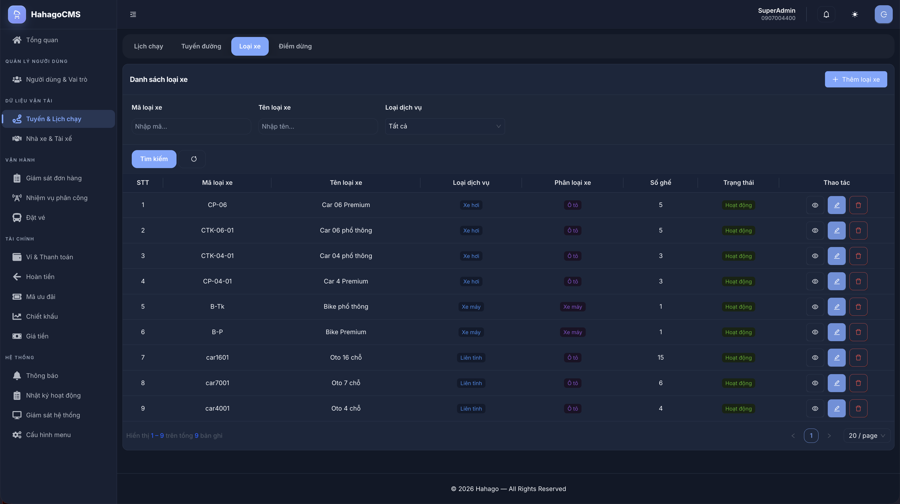
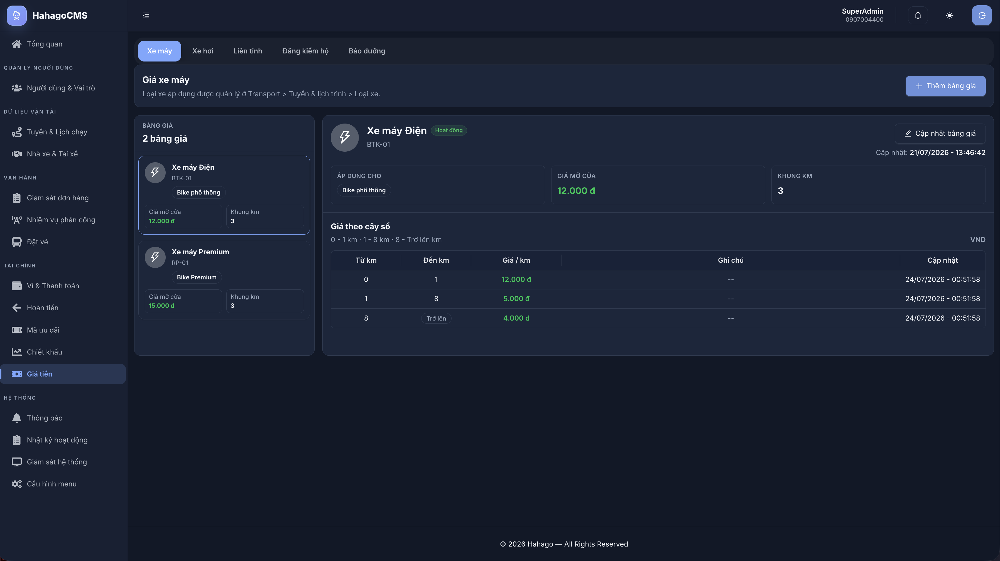
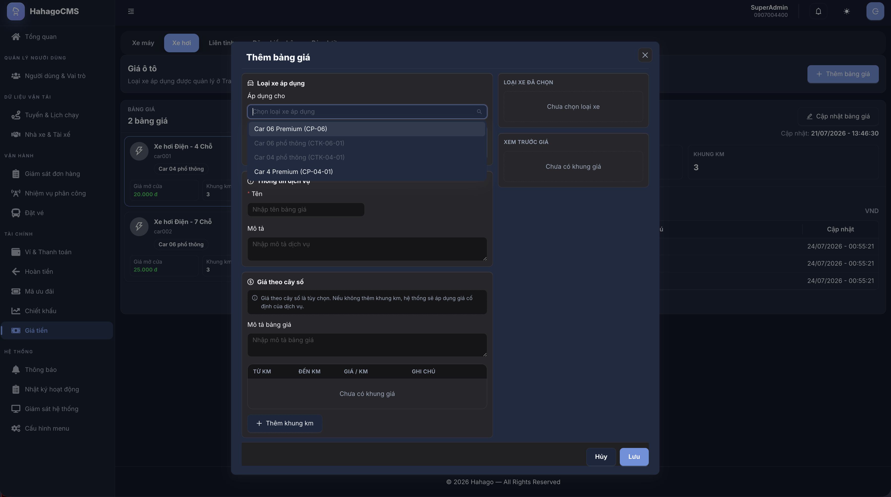
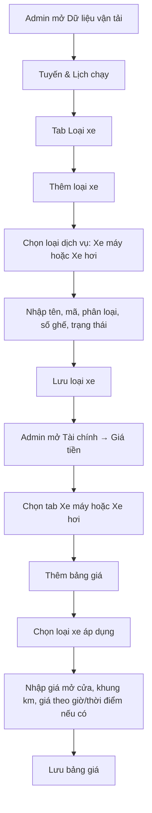
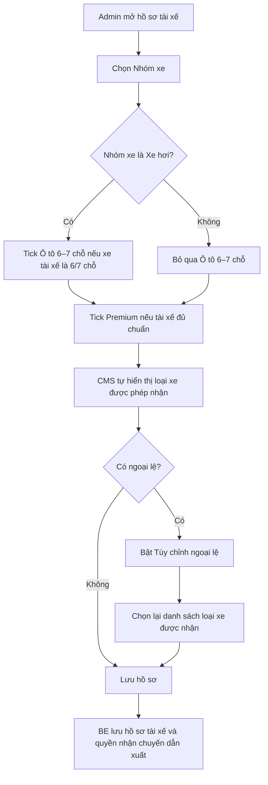
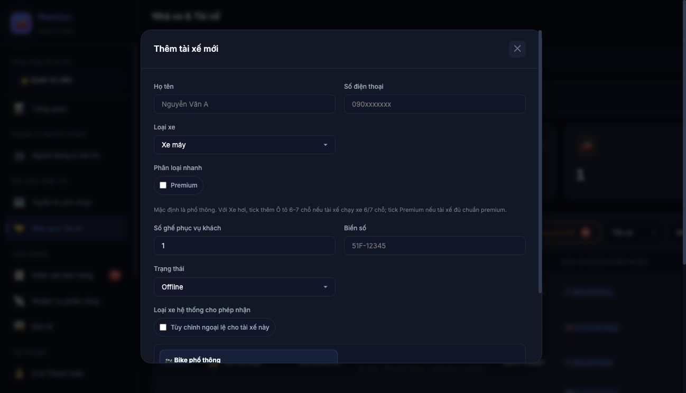
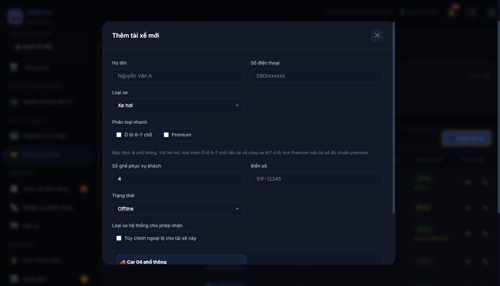
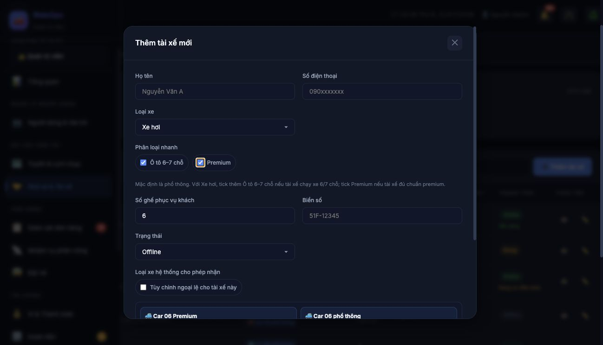
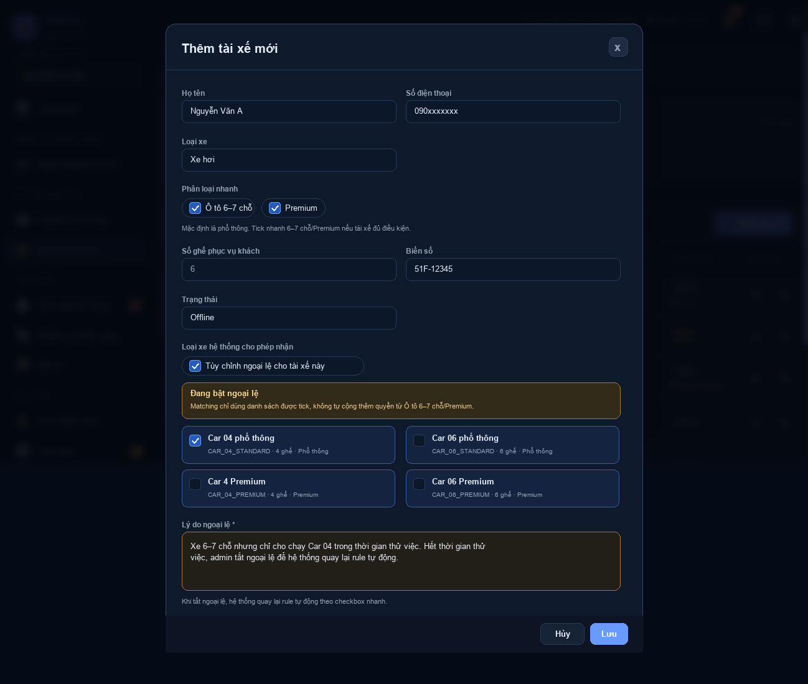
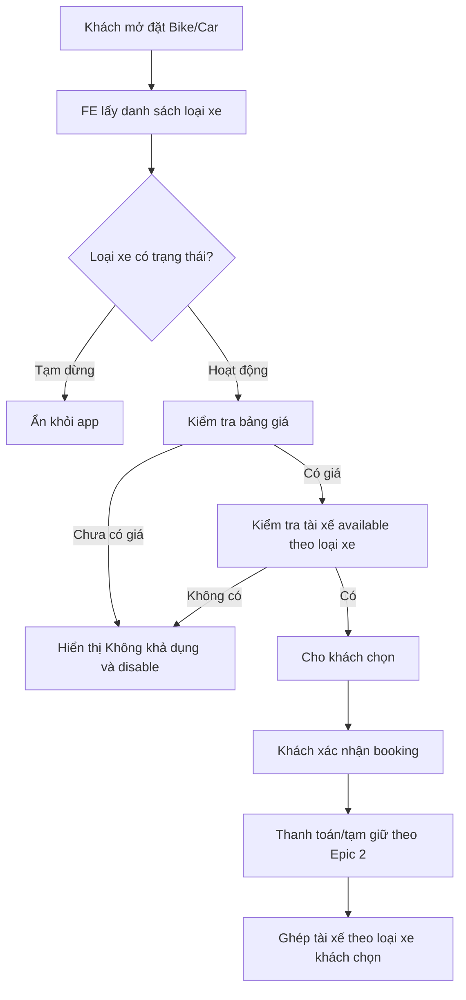

# Bike/Car — Quy trình loại xe, giá tiền và gán tài xế

Tài liệu này dùng để thống nhất cách CMS, BE, FE và BA xử lý luồng Bike/Car theo hướng mới:

```text
Khách chọn loại xe khi đặt chuyến
→ Giá tiền lấy theo loại xe
→ Tài xế được ghép chuyến theo xe riêng đang chạy và rule quyền nhận
```

Không tách riêng “tài xế” và “phương tiện” cho Bike/Car. Với Bike/Car, hiểu đơn giản:

```text
1 tài xế = 1 xe riêng
```

Trong hồ sơ tài xế đã có thông tin xe tài xế điều khiển.

## 1. Màn hình minh họa

### 1.1. Danh sách Loại xe



Màn hình này nằm trong:

```text
Dữ liệu vận tải → Tuyến & Lịch chạy → Loại xe
```

Dùng để tạo các loại xe khách có thể chọn khi đặt Bike/Car, ví dụ:

- Bike phổ thông
- Bike Premium
- Car 04 phổ thông
- Car 4 Premium
- Car 06 phổ thông
- Car 06 Premium

### 1.2. Giá tiền theo tab Xe máy/Xe hơi



Màn hình này nằm trong:

```text
Tài chính → Giá tiền
```

Giá tiền được lọc theo tab:

- Xe máy
- Xe hơi
- Liên tỉnh
- Đăng kiểm hộ
- Bảo dưỡng

Với Bike/Car, admin chọn tab Xe máy hoặc Xe hơi rồi tạo bảng giá cho từng loại xe.

### 1.3. Tạo bảng giá cho loại xe



Khi tạo bảng giá, admin chọn loại xe áp dụng. Danh sách loại xe được lọc theo tab đang mở:

- Đang ở tab Xe máy → chỉ chọn được loại xe máy.
- Đang ở tab Xe hơi → chỉ chọn được loại xe hơi.

## 2. Phân vai màn hình

| Nhóm | Màn hình | Mục đích |
|---|---|---|
| CMS | Loại xe | Tạo/sửa/tạm dừng loại xe Bike/Car để khách chọn |
| CMS | Giá tiền | Tạo giá theo từng loại xe |
| CMS | Nhà xe & Tài xế | Gán tài xế với xe riêng đang chạy |
| CMS | Nhà xe & Tài xế | Xem hệ thống tự tính tài xế được nhận loại xe nào |
| CMS | Nhiệm vụ phân công/Giám sát đơn hàng | Lọc tài xế available và điều phối thủ công khi cần |
| BE | Master data | Lưu loại xe, giá tiền, rule quyền nhận |
| BE | Matching | Chỉ đưa tài xế đủ điều kiện vào danh sách ghép chuyến |
| FE Customer | Booking Bike/Car | Hiển thị loại xe hoạt động, có giá và có tài xế available |
| FE Driver | App tài xế | Online/Offline, nhận offer đúng loại xe được phép |
| BA | Nghiệp vụ | Chốt rule loại xe, Premium, giá, trạng thái và UAT |

## 3. Trạng thái loại xe trên app

| Trạng thái CMS | Điều kiện thực tế | App khách |
|---|---|---|
| Hoạt động | Có bảng giá và có tài xế available | Cho chọn |
| Hoạt động | Chưa có giá hoặc chưa có tài xế available | Hiển thị Không khả dụng và disable |
| Tạm dừng | Không xét giá/tài xế | Ẩn khỏi app |

Lưu ý: “Hoạt động” chỉ có nghĩa loại xe được phép kinh doanh. Việc khách có chọn được hay không còn phụ thuộc giá và tài xế available tại thời điểm booking.

## 4. Quy trình CMS tạo loại xe và giá



## 5. Quy trình gán tài xế cho loại xe

Admin thao tác tại:

```text
Dữ liệu vận tải hoặc Vận hành → Nhà xe & Tài xế → Tài xế Bike/Car
```

Form tài xế cần theo hướng sau:

| Trường | Cách xử lý |
|---|---|
| Nhóm xe | Xe máy hoặc Xe hơi |
| Ô tô 6–7 chỗ | Checkbox nhanh, chỉ hiển thị/áp dụng cho Xe hơi |
| Premium | Checkbox nhanh, áp dụng cho Bike/Car nếu tài xế đủ chuẩn |
| Số ghế phục vụ khách | Hệ thống tự suy ra: Bike = 1, Car mặc định = 4, Car tick Ô tô 6–7 chỗ = 6 |
| Biển số | Nhập theo xe riêng của tài xế |
| Loại xe hệ thống cho phép nhận | Hệ thống tự tính, admin chỉ xem |
| Tùy chỉnh ngoại lệ | Chỉ bật khi cần xử lý trường hợp đặc biệt |

User flow:



## 6. Rule mặc định tài xế được nhận loại xe nào

| Nhóm xe/checkbox trong hồ sơ tài xế | Premium | Loại xe được nhận |
|---|---:|---|
| Xe máy, không tick Premium | Không | Bike phổ thông |
| Xe máy, tick Premium | Có | Bike Premium, Bike phổ thông |
| Xe hơi, không tick Ô tô 6–7 chỗ | Không | Car 04 phổ thông |
| Xe hơi, không tick Ô tô 6–7 chỗ | Có | Car 4 Premium, Car 04 phổ thông |
| Xe hơi, tick Ô tô 6–7 chỗ | Không | Car 06 phổ thông, Car 04 phổ thông |
| Xe hơi, tick Ô tô 6–7 chỗ | Có | Car 06 Premium, Car 06 phổ thông, Car 4 Premium, Car 04 phổ thông |

Nguyên tắc:

- Xe máy chỉ nhận loại xe máy.
- Xe hơi chỉ nhận loại xe hơi.
- Mặc định tài xế Xe hơi là phổ thông 4 chỗ.
- Tài xế Xe hơi chạy xe 6/7 chỗ chỉ cần tick nhanh **Ô tô 6–7 chỗ**.
- BE xác định loại xe 6–7 chỗ bằng dữ liệu Loại xe: `serviceType = CAR` và `seats >= 6 && seats <= 7`.
- BE không được hardcode theo tên như `Car 06`; nếu admin tạo `Car 07` với `seats = 7` thì vẫn thuộc nhóm 6–7 chỗ.
- Loại Premium chỉ được nhận khi tick nhanh **Premium**.
- Nếu sau này tạo loại xe mới nhưng chưa có rule riêng, tài xế mặc định chỉ nhận đúng loại xe đang chạy.
- Override chỉ dùng cho ngoại lệ, không dùng làm cách vận hành chính.

## 7. Hướng dẫn setup phân loại loại xe cho tài xế trên CMS

Admin không cần chọn từng loại xe con cho tài xế trong điều kiện bình thường. Chỉ cần setup theo checkbox nhanh.

### 7.1. Vị trí thao tác

```text
Nhà xe & Tài xế → Tài xế Bike/Car → Thêm/Sửa tài xế
```

### 7.2. Các bước setup

1. Chọn **Nhóm xe**:
   - Xe máy
   - Xe hơi
2. Nhập thông tin cơ bản:
   - Họ tên
   - Số điện thoại
   - Biển số
   - Trạng thái ban đầu
3. Nếu tài xế thuộc **Xe hơi**:
   - Không tick gì thêm → hệ thống hiểu là **Car 04 phổ thông**, số ghế = 4.
   - Tick **Ô tô 6–7 chỗ** → hệ thống hiểu tài xế có năng lực nhận các loại CAR có `seats` trong khoảng 6–7.
4. Nếu tài xế đủ chuẩn premium:
   - Tick **Premium**.
   - Không tick Premium → hệ thống chỉ cho nhận nhóm phổ thông.
5. Kiểm tra vùng **Loại xe hệ thống cho phép nhận**.
6. Nếu danh sách đúng → Lưu hồ sơ.
7. Chỉ bật **Tùy chỉnh ngoại lệ** khi BA/admin cần cấp khác rule mặc định.

### 7.3. Hình ảnh thao tác trên mock UI

#### Bước 1 — Tài xế Xe máy mặc định



Khi chọn **Xe máy** và không tick Premium, hệ thống tự hiểu tài xế nhận **Bike phổ thông**.

#### Bước 2 — Tài xế Xe hơi mặc định 4 chỗ



Khi chọn **Xe hơi** và không tick **Ô tô 6–7 chỗ** hoặc **Premium**, hệ thống tự hiểu tài xế nhận **Car 04 phổ thông**, số ghế = 4.

#### Bước 3 — Tài xế Xe hơi 6–7 chỗ + Premium



Khi tick **Ô tô 6–7 chỗ** và **Premium**, hệ thống tự hiểu tài xế có năng lực nhận nhóm xe 6–7 chỗ và nhóm Premium. Danh sách loại xe được nhận vẫn dựa trên các **Loại xe** đang có trong hệ thống.

### 7.4. Bảng kết quả sau khi tick

| Admin setup trong hồ sơ tài xế | Hệ thống hiểu là | Số ghế | Loại xe được phép nhận |
|---|---|---:|---|
| Xe máy, không tick Premium | Bike phổ thông | 1 | Bike phổ thông |
| Xe máy, tick Premium | Bike Premium | 1 | Bike Premium; Bike phổ thông |
| Xe hơi, không tick Ô tô 6–7 chỗ, không tick Premium | Car 04 phổ thông | 4 | Car 04 phổ thông |
| Xe hơi, không tick Ô tô 6–7 chỗ, tick Premium | Car 4 Premium | 4 | Car 4 Premium; Car 04 phổ thông |
| Xe hơi, tick Ô tô 6–7 chỗ, không tick Premium | Car 06 phổ thông | 6 | Car 06 phổ thông; Car 04 phổ thông |
| Xe hơi, tick Ô tô 6–7 chỗ, tick Premium | Car 06 Premium | 6 | Car 06 Premium; Car 06 phổ thông; Car 4 Premium; Car 04 phổ thông |

Nếu hệ thống có thêm `Car 07` với `seats = 7`, tài xế tick **Ô tô 6–7 chỗ** cũng được xét nhận `Car 07` theo cùng rule. Nếu chưa có loại CAR nào có `seats` từ 6 đến 7 đang hoạt động, CMS vẫn lưu năng lực tài xế nhưng preview chỉ hiển thị các loại CAR hiện có.

### 7.5. Khi nào dùng Tùy chỉnh ngoại lệ?

Không dùng override để setup 6 chỗ hoặc premium, vì hai trường hợp này đã có checkbox nhanh.

Chỉ dùng override khi có ngoại lệ thật, ví dụ:

- Tài xế tạm thời bị khóa nhận Premium dù hồ sơ vẫn đạt chuẩn.
- Tài xế được cấp thử nghiệm một loại xe đặc biệt chưa có rule mặc định.
- BA/admin cần khóa một loại xe cụ thể do chính sách vận hành.

Khi bật override, hệ thống sẽ dùng danh sách admin chọn thủ công thay cho rule mặc định. Vì vậy mọi thay đổi override cần có audit log.

#### Bước 4 — Case ngoại lệ: chỉ cho tài xế nhận một số loại xe thủ công



Ví dụ trên: tài xế có xe 6–7 chỗ và đủ chuẩn Premium, nhưng trong thời gian thử việc admin chỉ cho nhận **Car 04 phổ thông**. Khi bật **Tùy chỉnh ngoại lệ**, matching dùng đúng danh sách được tick và CMS bắt buộc nhập **Lý do ngoại lệ**.

### 7.6. Các trường hợp ngoại lệ thường gặp

| Trường hợp | Cách setup trên CMS | Kết quả mong muốn |
|---|---|---|
| Tài xế đủ chuẩn Premium nhưng bị khóa Premium tạm thời | Giữ tick Premium nếu hồ sơ vẫn đạt, bật Tùy chỉnh ngoại lệ và bỏ các loại Premium khỏi danh sách được nhận | Tài xế chỉ nhận nhóm phổ thông trong thời gian bị khóa |
| Tài xế xe 6–7 chỗ nhưng chỉ được chạy cuốc 4 chỗ trong thời gian thử việc | Tick Ô tô 6–7 chỗ để lưu năng lực xe, bật Tùy chỉnh ngoại lệ và chỉ giữ Car 04 phổ thông/Car 4 Premium nếu được phép | Tài xế không nhận cuốc 6–7 chỗ dù hồ sơ có xe 6–7 chỗ |
| Tài xế được cấp thử nghiệm loại xe mới chưa nằm trong rule mặc định | Bật Tùy chỉnh ngoại lệ và chọn thêm loại xe thử nghiệm | Matching đưa tài xế vào loại xe thử nghiệm theo danh sách override |
| Một loại xe cụ thể bị khóa do giấy tờ/phương tiện không đạt | Bật Tùy chỉnh ngoại lệ và bỏ loại xe đó khỏi danh sách được nhận | Tài xế không nhận loại xe bị khóa, vẫn có thể nhận loại khác |
| Tài xế chỉ được nhận Premium hoặc chỉ được nhận phổ thông theo chính sách riêng | Bật Tùy chỉnh ngoại lệ và chỉ tick đúng nhóm loại xe được phép | Matching chỉ xét đúng danh sách được tick, không tự cộng thêm loại còn lại |
| Tài xế đổi xe tạm thời khác với hồ sơ gốc | Cập nhật nhóm xe/checkbox nhanh nếu đổi dài hạn; nếu chỉ tạm thời thì bật Tùy chỉnh ngoại lệ và ghi rõ thời gian/lý do | Trong thời gian override, tài xế chỉ nhận loại xe phù hợp xe tạm thời |
| Loại xe được tạo sai số ghế, ví dụ Car 06 nhưng nhập `seats = 5` | Không xử lý bằng override; admin phải sửa lại Loại xe trong dữ liệu vận tải | BE chỉ xem là nhóm 6–7 chỗ khi `seats >= 6 && seats <= 7`, tránh match sai |
| Hệ thống chưa có loại CAR 6–7 chỗ đang hoạt động | Không cần bật override; tick Ô tô 6–7 chỗ vẫn lưu năng lực tài xế | Preview chỉ hiển thị các loại xe hiện có; tài xế chưa nhận cuốc 6–7 cho đến khi loại xe 6–7 được tạo/hoạt động |

Nguyên tắc xử lý ngoại lệ:

- Override luôn ưu tiên hơn rule mặc định khi matching.
- Khi tắt override, hệ thống quay lại tính quyền nhận theo checkbox nhanh.
- Mỗi lần bật/tắt override hoặc thay danh sách override cần ghi audit log.
- CMS bắt buộc nhập **Lý do ngoại lệ** khi bật override.
- Nếu ngoại lệ có thời hạn, BA/admin nên ghi rõ mốc bắt đầu/kết thúc trong lý do để vận hành chủ động rà soát.

## 8. Logic BE khi khách đặt Bike/Car



Khi ghép tài xế, BE chỉ lấy tài xế thỏa tất cả điều kiện:

1. Cùng nhóm xe Bike hoặc Car với booking.
2. Loại xe khách chọn nằm trong danh sách tài xế được phép nhận.
3. Tài xế Online.
4. Tài xế không Bận, không có chuyến đang chạy.
5. Không có offer đang chờ accept.
6. GPS/heartbeat còn hợp lệ.
7. Hồ sơ và giấy tờ còn hiệu lực.
8. Vị trí tài xế nằm trong bán kính tìm kiếm của loại xe.

`Available` không phải trạng thái lưu cố định. Đây là kết quả tính tại thời điểm tìm tài xế.

## 9. Logic xử lý override

Mặc định:

```text
allowedTypes = rule(nhóm xe, checkbox Ô tô 6–7 chỗ, checkbox Premium)
```

Khi bật override:

```text
allowedTypes = danh sách admin chọn riêng cho tài xế đó
```

Quy tắc dùng override:

- Chỉ bật khi cần ngoại lệ nghiệp vụ.
- Khi tắt override, hệ thống quay lại rule mặc định.
- Audit log cần ghi lại ai bật/tắt override và danh sách loại xe sau khi lưu.
- BA cần xác nhận từng ngoại lệ để tránh cấp sai loại Premium.
- Nếu override đang bật, matching không tự cộng thêm quyền từ checkbox Ô tô 6–7 chỗ/Premium; matching dùng đúng danh sách override admin đã chọn.

## 10. Checklist cho dev theo role

### CMS

- Có màn Loại xe trong nhóm Dữ liệu vận tải.
- Giá tiền có tab Xe máy/Xe hơi và lọc đúng loại xe theo tab.
- Form tài xế chọn được nhóm xe và tick nhanh Ô tô 6–7 chỗ/Premium.
- Số ghế tự suy ra từ nhóm xe và checkbox Ô tô 6–7 chỗ.
- Có checkbox Premium.
- Hiển thị danh sách loại xe hệ thống cho phép nhận.
- Có tùy chọn override ngoại lệ.
- Danh sách tài xế/điều phối hiển thị lý do không available nếu sai loại xe hoặc ngoài bán kính.

### BE

- Lưu master data Loại xe.
- Lưu bảng giá theo loại xe.
- Lưu rule quyền nhận theo nhóm xe và checkbox Ô tô 6–7 chỗ/Premium.
- Tự sinh danh sách loại xe tài xế được phép nhận.
- Chỉ matching tài xế có quyền nhận đúng loại xe khách chọn.
- Tách rõ trạng thái Online/Offline/Bận và kết quả available.
- Khi hoàn thành/hủy chuyến, giải phóng tài xế khỏi trạng thái Bận theo flow Epic 4.

### FE Customer

- Hiển thị loại xe theo trạng thái:
  - Tạm dừng: ẩn.
  - Hoạt động nhưng không khả dụng: disable.
  - Hoạt động và khả dụng: cho chọn.
- Giá preview lấy theo loại xe khách chọn.
- Khi không có tài xế available, thông báo theo ngôn ngữ khách hàng dễ hiểu.

### FE Driver

- Tài xế bấm Online/Offline trên app.
- Khi Online, app gửi vị trí/heartbeat theo cơ chế Epic 3.
- Driver chỉ nhận offer đúng loại xe được phép.
- Khi accept chuyến, app chuyển trạng thái hiển thị sang Đang chạy/Bận.

### BA

- Chốt danh sách loại xe Bike/Car ban đầu.
- Chốt rule Premium và rule xe lớn nhận xe nhỏ.
- Chốt nội dung hiển thị Không khả dụng trên app khách.
- Chốt trường hợp nào được dùng override.
- Chuẩn bị UAT theo từng loại xe và từng trạng thái tài xế.

## 11. UAT nhanh

| Case | Kỳ vọng |
|---|---|
| Bike phổ thông, không Premium | Chỉ nhận Bike phổ thông |
| Bike Premium, Premium = Có | Nhận Bike Premium và Bike phổ thông |
| Bike Premium, Premium = Không | Không nhận Bike Premium, chỉ nhận Bike phổ thông |
| Car 04 phổ thông | Chỉ nhận Car 04 phổ thông |
| Car 06 phổ thông | Nhận Car 06 phổ thông và Car 04 phổ thông |
| Car 06 Premium, Premium = Có | Nhận đủ nhóm Car 06/04 Premium/phổ thông theo rule |
| Loại xe tạm dừng | App khách ẩn loại xe |
| Loại xe hoạt động nhưng chưa có tài xế available | App khách hiển thị Không khả dụng và disable |
| Driver Online nhưng sai loại xe | Không được đưa vào matching |
| Driver Online đúng loại xe nhưng ngoài bán kính | Không available hoặc chỉ hiển thị để điều phối thủ công theo policy |
| Bật override cho một tài xế | Matching dùng danh sách override thay vì rule mặc định |
