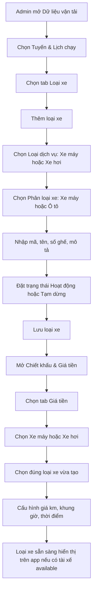
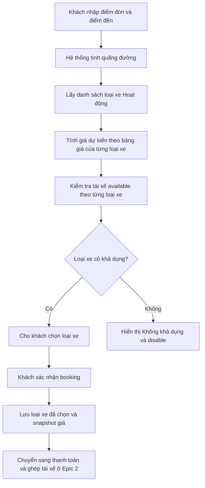

# Epic 1 — Loại xe và giá Bike/Car

## 1. Chốt hướng làm

Không tạo menu riêng **Loại dịch vụ Bike/Car** nữa.

Bike/Car dùng chung master data **Loại xe** tại:

```text
Dữ liệu vận tải → Tuyến & Lịch chạy → Loại xe
```

Admin tạo loại xe cho **Xe máy** hoặc **Xe hơi** tại đây. Sau đó vào:

```text
Chiết khấu & Giá tiền → Giá tiền
```

để tạo/cập nhật bảng giá theo đúng loại xe đã tạo.

## 2. Dữ liệu loại xe

Mỗi loại xe cần có:

| Trường | Ý nghĩa |
|---|---|
| Mã loại xe | Mã duy nhất, ví dụ `B-TK`, `CP-06` |
| Tên loại xe | Tên app khách nhìn thấy, ví dụ Bike phổ thông, Bike Premium, Car 06 Premium |
| Loại dịch vụ | Xe máy, Xe hơi hoặc Liên tỉnh |
| Phân loại xe | Xe máy hoặc Ô tô |
| Số ghế phục vụ khách | Số khách tối đa tài xế được chở, không tính tài xế nếu BA chốt như vậy |
| Trạng thái | Hoạt động hoặc Tạm dừng |
| Mô tả | Mô tả ngắn cho admin/app nếu cần |

Quy tắc trạng thái:

- **Tạm dừng:** ẩn trên app khách.
- **Hoạt động + có giá + có tài xế available:** app khách cho chọn.
- **Hoạt động nhưng chưa có giá hoặc không có tài xế available:** app khách hiển thị **Không khả dụng** và disable.

## 3. Dữ liệu giá tiền

Màn giá tiền đặt tại:

```text
Chiết khấu & Giá tiền → Giá tiền
```

Có các tab:

- Xe máy
- Xe hơi
- Liên tỉnh
- Đăng kiểm hộ
- Bảo dưỡng hộ

Trong tab **Xe máy**, chỉ hiển thị/tạo giá cho loại xe có `Loại dịch vụ = Xe máy`.

Trong tab **Xe hơi**, chỉ hiển thị/tạo giá cho loại xe có `Loại dịch vụ = Xe hơi`.

Mỗi bảng giá Bike/Car gồm:

1. Giá mở cửa và giá theo khoảng km.
2. Phụ phí theo khung giờ.
3. Phụ phí theo thời điểm.

```text
Giá dự kiến = Giá theo km
             + Phụ phí khung giờ
             + Phụ phí thời điểm
             - Khuyến mãi
```

Khi khách xác nhận booking, hệ thống phải lưu snapshot giá đã tính. Admin sửa giá sau đó chỉ ảnh hưởng booking mới.

## 4. Chiết khấu

Chiết khấu không tách theo từng loại xe con.

Chỉ cấu hình:

- Chiết khấu chung cho Xe máy.
- Chiết khấu chung cho Xe hơi.

Tại màn giá theo loại xe, phần chiết khấu chỉ hiển thị để tham chiếu, không sửa trực tiếp.

## 5. Phạm vi ảnh hưởng theo vai trò

| Vai trò | Cần làm |
|---|---|
| CMS | Cập nhật tab Loại xe; tạo/sửa loại xe Bike/Car; tab Giá tiền lọc đúng Xe máy/Xe hơi; hiển thị trạng thái Hoạt động/Tạm dừng; hiển thị chiết khấu chỉ xem |
| BE | Lưu loại xe; liên kết bảng giá theo loại xe; tính giá theo km/khung giờ/thời điểm; lưu snapshot giá khi booking được xác nhận |
| FE Customer | Hiển thị danh sách loại xe Hoạt động; show giá dự kiến; ẩn loại Tạm dừng; disable loại Không khả dụng |
| FE Driver | Hiển thị đúng loại xe khách đặt trong offer/chuyến |
| BA | Chốt danh sách loại xe ban đầu, số ghế phục vụ khách, công thức giá và kịch bản UAT |

## 6. User flow — Admin tạo loại xe và giá



## 7. User flow — Khách đặt Bike/Car



## 8. Tiêu chí nghiệm thu

- Admin tạo được loại xe Bike/Car trong tab Loại xe.
- Giá tiền chỉ chọn được loại xe đúng tab Xe máy hoặc Xe hơi.
- Loại xe Tạm dừng không hiển thị trên app khách.
- Loại xe Hoạt động nhưng chưa đủ điều kiện hiển thị Không khả dụng và không chọn được.
- Booking lưu đúng loại xe khách chọn và snapshot giá tại thời điểm xác nhận.
- Chiết khấu chỉ lấy theo nhóm Xe máy hoặc Xe hơi, không tách theo từng loại xe con.
