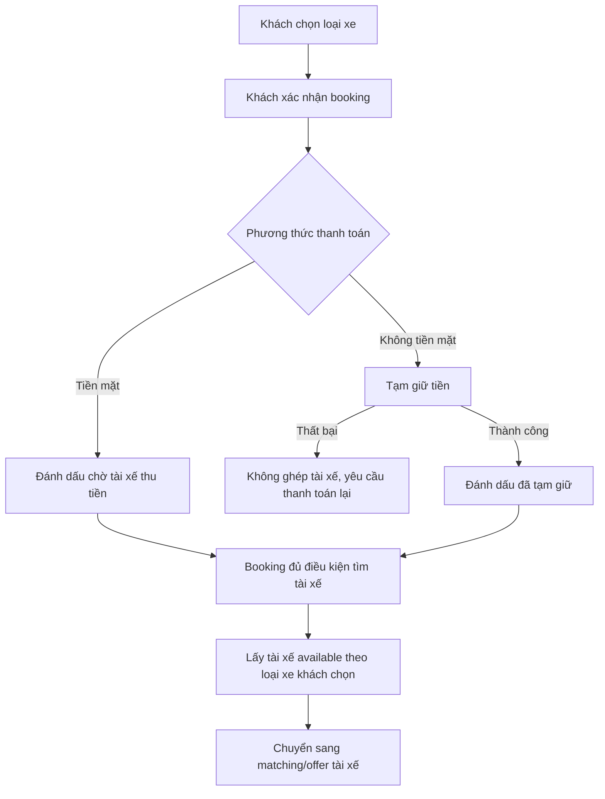
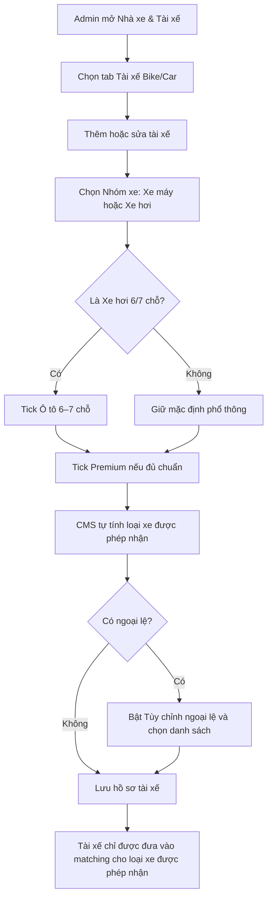
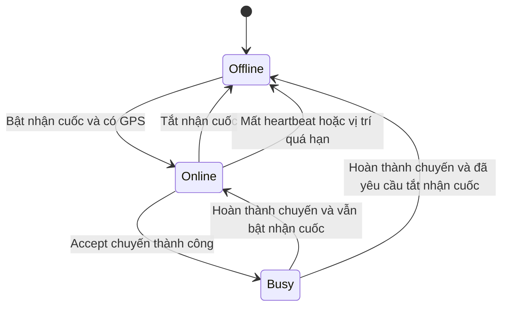

# Epic 2 — Thanh toán, trạng thái tài xế và quyền nhận loại xe

## 1. Chốt hướng làm

Booking Bike/Car không cần admin Accept/Decline trước khi điều phối.

Hệ thống tự đưa booking vào ghép tài xế theo kết quả thanh toán:

- **Tiền mặt:** booking được vào ghép chuyến ngay sau khi khách xác nhận. Hệ thống chỉ ghi nhận là chờ tài xế thu tiền, không xem là đã thu thật.
- **Không tiền mặt:** booking chỉ được vào ghép chuyến sau khi tạm giữ tiền thành công.
- **Tạm giữ thất bại:** không gửi chuyến cho tài xế; khách phải thanh toán lại hoặc đổi phương thức.

Accept/Decline là thao tác của **tài xế** khi nhận offer, không phải bước duyệt của admin.

## 2. Trạng thái tài xế

Hệ thống cần có đủ 3 trạng thái:

| Trạng thái | Ý nghĩa | Có thể ghép chuyến? |
|---|---|---|
| Offline | Tài xế tắt nhận cuốc, đăng xuất, mất kết nối hoặc GPS/vị trí hết hạn | Không |
| Online | Tài xế bật nhận cuốc và backend còn nhận heartbeat/vị trí | Chỉ khi `available = true` |
| Bận | Tài xế đã nhận và đang thực hiện một chuyến | Không |

Quy tắc:

- Online/Offline do tài xế bấm trên app.
- Bận do hệ thống tự chuyển sau khi tài xế accept chuyến.
- Tài xế không tự bật Bận.
- Nếu tài xế muốn Offline khi đang Bận, hệ thống ghi nhận yêu cầu và chỉ chuyển Offline sau khi chuyến kết thúc.

## 3. Hồ sơ tài xế Bike/Car

Bike/Car là mô hình:

```text
1 tài xế = 1 xe riêng
```

Không tách tài xế và phương tiện thành hai danh sách riêng như liên tỉnh.

Trong hồ sơ tài xế cần có:

| Trường | Ý nghĩa |
|---|---|
| Nhóm xe | Xe máy hoặc Xe hơi |
| Biển số | Biển số xe riêng của tài xế |
| Ô tô 6–7 chỗ | Checkbox nhanh, chỉ áp dụng cho tài xế Xe hơi |
| Premium | Checkbox nhanh, dùng để cho phép nhận nhóm Premium |
| Số ghế phục vụ khách | Hệ thống tự suy ra: Bike = 1, Car mặc định = 4, Car tick Ô tô 6–7 chỗ = 6 |
| Loại xe hệ thống cho phép nhận | Danh sách hệ thống tự suy ra từ nhóm xe + checkbox Ô tô 6–7 chỗ/Premium |
| Tùy chỉnh ngoại lệ | Chỉ bật khi cần cấp/khóa khác rule mặc định |
| Trạng thái | Online, Offline hoặc Bận |
| Hồ sơ/giấy tờ | Còn hiệu lực hay không |

## 4. Cách gán tài xế cho loại xe được phép chạy

Admin gán tại:

```text
Nhà xe & Tài xế → Tài xế Bike/Car → Thêm/Sửa tài xế
```

Flow gán:

1. Admin chọn **Nhóm xe** của tài xế: Xe máy hoặc Xe hơi.
2. Nếu là Xe hơi và tài xế chạy xe 6/7 chỗ, admin tick nhanh **Ô tô 6–7 chỗ**.
3. Nếu tài xế đủ chuẩn premium, admin tick nhanh **Premium**.
4. CMS tự lấy số ghế và hiển thị danh sách **Loại xe hệ thống cho phép nhận**.
5. Nếu có ngoại lệ, admin bật **Tùy chỉnh ngoại lệ** rồi chọn lại danh sách được nhận.
6. Lưu hồ sơ tài xế.

Quy tắc mặc định:

- Tài xế Xe máy chỉ được gán loại xe thuộc tab Xe máy.
- Tài xế Xe hơi chỉ được gán loại xe thuộc tab Xe hơi.
- Loại xe được phép nhận không được vượt quá số ghế xe riêng của tài xế.
- Mặc định tài xế Xe hơi là phổ thông 4 chỗ.
- Tài xế Xe hơi chạy xe 6/7 chỗ chỉ cần tick nhanh **Ô tô 6–7 chỗ**.
- BE xác định loại xe 6–7 chỗ bằng dữ liệu Loại xe: `serviceType = CAR` và `seats >= 6 && seats <= 7`, không hardcode theo tên loại xe.
- Loại Premium chỉ được nhận khi tick nhanh **Premium**.
- Nếu chưa có rule riêng cho loại xe mới, mặc định tài xế chỉ nhận đúng loại xe đang chạy.

Ví dụ:

| Hồ sơ tài xế | Hệ thống tự cho nhận |
|---|---|
| Xe máy, không tick Premium | Bike phổ thông |
| Xe máy, tick Premium | Bike Premium; Bike phổ thông |
| Xe hơi, không tick Ô tô 6–7 chỗ, không tick Premium | Car 04 phổ thông |
| Xe hơi, không tick Ô tô 6–7 chỗ, tick Premium | Car 4 Premium; Car 04 phổ thông |
| Xe hơi, tick Ô tô 6–7 chỗ, không tick Premium | Car 06 phổ thông; Car 04 phổ thông |
| Xe hơi, tick Ô tô 6–7 chỗ, tick Premium | Car 06 Premium; Car 06 phổ thông; Car 4 Premium; Car 04 phổ thông |

### Trường hợp ngoại lệ

Override chỉ dùng khi cần xử lý khác rule mặc định. Không dùng override để setup 6–7 chỗ hoặc Premium vì hai case này đã có checkbox nhanh.

| Trường hợp | Cách xử lý |
|---|---|
| Khóa Premium tạm thời | Bật override và bỏ các loại Premium khỏi danh sách được nhận |
| Xe 6–7 chỗ nhưng chỉ cho chạy 4 chỗ trong thời gian thử việc | Bật override và chỉ giữ nhóm Car 04 phù hợp |
| Cấp thử loại xe mới chưa nằm trong rule | Bật override và chọn thêm loại xe thử nghiệm |
| Khóa một loại xe do giấy tờ/phương tiện không đạt | Bật override và bỏ loại xe đó |
| Chỉ cho nhận Premium hoặc chỉ cho nhận phổ thông theo chính sách riêng | Bật override và chỉ tick đúng loại được phép nhận |
| Đổi xe tạm thời khác hồ sơ gốc | Nếu đổi ngắn hạn, bật override và ghi rõ thời gian/lý do; nếu đổi dài hạn thì cập nhật lại hồ sơ xe |
| Loại xe master data nhập sai số ghế | Không dùng override; sửa số ghế ở Loại xe để BE phân nhóm đúng |
| Chưa có loại CAR 6–7 chỗ đang hoạt động | Không cần override; tick Ô tô 6–7 chỗ vẫn lưu năng lực, nhưng preview/matching chỉ dùng loại xe hiện có |

Khi override đang bật, matching dùng đúng danh sách override admin chọn và không tự cộng thêm quyền từ checkbox nhanh. CMS bắt buộc nhập **Lý do ngoại lệ** để phục vụ audit và rà soát vận hành.

## 5. Điều kiện `available`

`Available` không phải trạng thái thứ tư. Đây là kết quả kiểm tra tại thời điểm hệ thống tìm tài xế cho booking.

Tài xế chỉ `available = true` khi đồng thời thỏa:

1. Đang Online.
2. Không Bận.
3. Không có offer khác đang chờ phản hồi.
4. Được cấp quyền nhận đúng loại xe khách đã chọn.
5. Xe riêng cùng nhóm dịch vụ và đủ số ghế.
6. Hồ sơ tài xế và giấy tờ còn hiệu lực.
7. Tài khoản không bị khóa/tạm ngừng.
8. GPS đang bật.
9. Backend nhận được heartbeat/vị trí mới trong ngưỡng cho phép.
10. Vị trí tài xế nằm trong bán kính tìm kiếm hiện tại.
11. Tài xế chưa từ chối hoặc timeout với booking này trong phiên ghép hiện tại.

Online không đồng nghĩa với Available.

## 6. Cấu hình bán kính ghép chuyến

Bán kính nên cấu hình theo **loại xe Bike/Car**, vì mỗi loại có thể có mật độ tài xế khác nhau.

Có thể đặt thao tác tại dòng loại xe hoặc trong màn cấu hình liên quan đến loại xe.

Mỗi loại xe có:

| Cấu hình | Ý nghĩa |
|---|---|
| Bán kính ban đầu | Phạm vi tìm ở vòng đầu tiên |
| Bước mở rộng | Số km tăng thêm khi chưa có tài xế nhận |
| Bán kính tối đa | Giới hạn cuối cùng |

Quy tắc:

- Bán kính ban đầu phải lớn hơn 0.
- Bán kính ban đầu không được lớn hơn bán kính tối đa.
- Cấu hình mới chỉ áp dụng cho phiên ghép chuyến mới.
- Trong mỗi vòng, chỉ tài xế `available = true` mới được đưa vào danh sách ứng viên.

## 7. Phạm vi ảnh hưởng theo vai trò

| Vai trò | Cần làm |
|---|---|
| CMS | Quản lý tài xế Bike/Car; hiển thị Online/Offline/Bận; gán loại xe tài xế đang chạy; hiển thị quyền nhận loại xe tự tính; cho phép override ngoại lệ; cấu hình bán kính theo loại xe; hiển thị lý do không available |
| BE | Quản lý trạng thái; lưu heartbeat/vị trí; kiểm tra thanh toán; kiểm tra quyền nhận loại xe; tính available; khóa tài xế khi có offer/chuyến |
| FE Customer | Xử lý xác nhận booking theo phương thức thanh toán; hiển thị đang tìm tài xế; phân biệt lỗi thanh toán và không tìm được tài xế |
| FE Driver | Có nút Online/Offline; gửi heartbeat/vị trí; nhận offer đúng loại xe được phép; hiển thị Bận khi đã accept chuyến |
| BA | Chốt quy tắc thanh toán, ngưỡng heartbeat/GPS, rule đủ ghế, rule Premium/Phổ thông và kịch bản UAT |

## 8. User flow — Khách xác nhận booking



## 9. User flow — Admin gán loại xe cho tài xế



## 10. User flow — Tài xế Online/Offline/Bận



## 11. Tiêu chí nghiệm thu

- Không có bước admin duyệt booking Bike/Car trước điều phối.
- Tiền mặt được vào ghép chuyến nhưng chưa ghi nhận đã thu thật.
- Không tiền mặt chỉ ghép sau khi tạm giữ thành công.
- CMS có đủ Online, Offline, Bận.
- CMS gán được loại xe tài xế đang chạy và hiển thị loại xe được phép nhận tự tính.
- Tài xế chỉ được matching khi có quyền đúng loại xe khách chọn.
- Xe nhỏ không nhận được loại xe lớn hơn.
- Xe lớn nhận loại xe nhỏ hơn theo rule mặc định hoặc override ngoại lệ.
- Online nhưng thiếu GPS, đang có offer, đang Bận, sai loại xe, hồ sơ lỗi hoặc ngoài bán kính thì không được coi là available.
