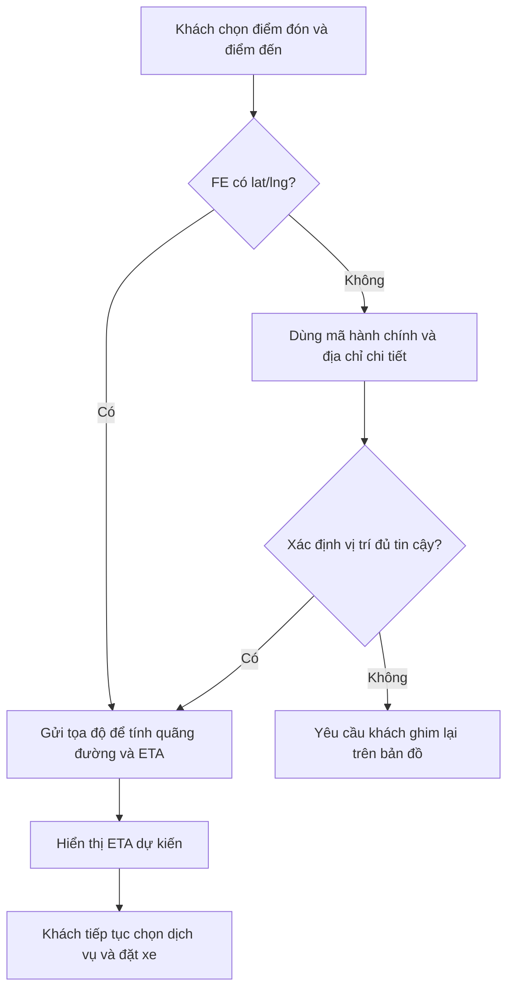
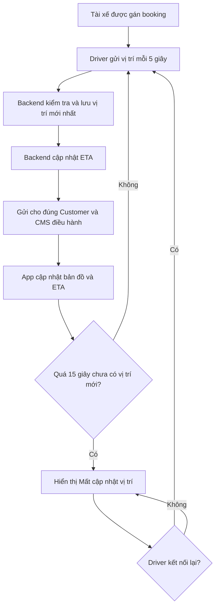
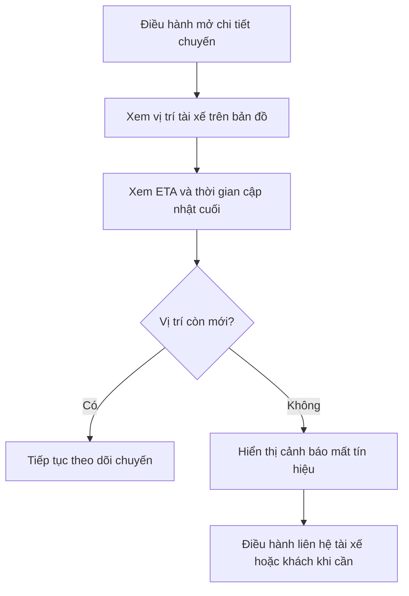

# Epic 3 — Vị trí thời gian thực và ETA

## 1. Trả lời chốt

App tài xế gửi vị trí về backend mỗi **5 giây**. Backend kiểm tra, lưu vị trí mới nhất và chuyển cập nhật cho đúng app khách đang có chuyến với tài xế đó.

Backend luôn đứng giữa Driver và Customer; tài xế không gửi trực tiếp vị trí sang khách.

ETA ưu tiên sử dụng tọa độ `lat/lng`. Nếu FE chưa lấy được tọa độ, hệ thống dùng mã tỉnh/thành, quận/huyện, phường/xã kèm địa chỉ chi tiết để xác định tọa độ. Nếu kết quả không đủ tin cậy, khách phải chọn lại điểm trên bản đồ.

Epic này chốt **hành vi nghiệp vụ và user flow**. Công nghệ socket/pub-sub, bản đồ và nơi lưu dữ liệu do team kỹ thuật thống nhất riêng với anh Tuấn.

## 2. Phạm vi tính năng

### Trong phạm vi

- Driver cập nhật vị trí mỗi 5 giây khi đang Online hoặc đang thực hiện chuyến.
- Backend xác thực và lưu vị trí mới nhất.
- Customer xem vị trí tài xế sau khi đã ghép chuyến.
- Hiển thị ETA tài xế đến điểm đón và cập nhật trong quá trình di chuyển.
- Phát hiện vị trí cũ, mất kết nối và kết nối lại.
- CMS theo dõi vị trí, lần cập nhật cuối và trạng thái kết nối của chuyến.
- Dùng địa chỉ đầy đủ làm fallback khi chưa có tọa độ.

### Không thuộc Epic 3

- Lựa chọn tài xế và thứ tự gửi offer.
- Cấu hình giá theo vùng.
- Lưu toàn bộ lịch sử hành trình dài hạn để phân tích.
- Chốt nhà cung cấp bản đồ hoặc thiết kế API.

## 3. Quy tắc hoạt động

### Cập nhật vị trí

- App Driver gửi vị trí mỗi 5 giây.
- Vị trí phải có tọa độ, thời gian ghi nhận và độ chính xác GPS.
- Backend chỉ nhận vị trí của tài xế hợp lệ và không chấp nhận dữ liệu quá cũ hoặc sai định dạng.
- Backend lưu vị trí mới nhất để phục vụ availability, theo dõi chuyến và ETA.
- Chỉ Customer của booking đang được gán tài xế mới được nhận cập nhật vị trí đó.
- Khi booking kết thúc hoặc bị hủy, Customer không còn nhận vị trí tài xế.

### Mất cập nhật

- Quá 15 giây không có vị trí mới: đánh dấu vị trí đã cũ và hiển thị **Mất cập nhật vị trí**.
- Không tự giả lập tài xế tiếp tục di chuyển khi không có dữ liệu mới.
- Khi Driver kết nối lại, backend nhận vị trí mới nhất rồi tiếp tục phát cập nhật.
- Trạng thái stale dùng trong ghép chuyến phải thống nhất với điều kiện available ở Epic 2.

### ETA và địa chỉ

- Có tọa độ: tính ETA trực tiếp từ vị trí tài xế đến điểm đón hoặc từ điểm đón đến điểm đến tùy bước booking.
- Chưa có tọa độ: dùng đủ mã hành chính và địa chỉ chi tiết để xác định tọa độ.
- Chỉ có mã tỉnh/huyện/xã: không đủ chính xác để tính ETA.
- Kết quả xác định vị trí không đáng tin cậy: yêu cầu khách ghim lại vị trí trên bản đồ.
- ETA là giá trị dự kiến và được cập nhật lại khi vị trí hoặc điều kiện di chuyển thay đổi.

## 4. Phạm vi ảnh hưởng theo vai trò

| Vai trò | Phần phải thực hiện | Kết quả mong đợi |
|---|---|---|
| **CMS** | Màn theo dõi chuyến; vị trí tài xế trên bản đồ; thời điểm cập nhật cuối; cảnh báo mất vị trí; ETA hiện tại | Điều hành nhận biết được chuyến đang di chuyển hay mất tín hiệu |
| **BE** | Nhận và kiểm tra vị trí; lưu vị trí mới nhất; kiểm soát quyền xem; phát cập nhật; đánh dấu stale; yêu cầu tính lại ETA | Dữ liệu vị trí đúng tài xế, đúng booking và đúng người nhận |
| **FE Customer** | Lấy/chọn tọa độ điểm đón, điểm đến; hiển thị vị trí tài xế và ETA; hiển thị mất cập nhật; yêu cầu chọn lại điểm khi địa chỉ không chính xác | Khách theo dõi được tài xế mà không nhìn thấy dữ liệu không hợp lệ |
| **FE Driver** | Xin quyền GPS; gửi vị trí mỗi 5 giây; tiếp tục gửi khi reconnect; cảnh báo khi GPS bị tắt | Backend luôn có dữ liệu đủ mới khi tài xế nhận cuốc hoặc chạy chuyến |
| **BA** | Chốt thời gian stale, nội dung cảnh báo, thời điểm bắt đầu/kết thúc chia sẻ vị trí, quy tắc fallback địa chỉ và kịch bản UAT | Quyền riêng tư và cách hiển thị nhất quán giữa CMS và app |

## 5. User flow — Khách chọn điểm và nhận ETA

## 6. User flow — Theo dõi tài xế sau khi ghép chuyến

## 7. User flow — Admin/điều hành trên CMS

## 8. Checklist triển khai theo vai trò

### CMS

- Hiển thị thời gian vị trí cuối, không chỉ hiển thị marker.
- Phân biệt đang cập nhật và mất tín hiệu.
- Chỉ người có quyền điều hành mới xem được vị trí chuyến.

### BE

- Không phát vị trí cho booking hoặc người dùng không liên quan.
- Loại bỏ dữ liệu sai, quá cũ hoặc đến không đúng thứ tự.
- Dừng chia sẻ khi chuyến kết thúc/hủy.
- Đồng bộ quy tắc vị trí stale với Epic 2.

### FE

- Driver xử lý quyền GPS, chạy nền và reconnect.
- Customer không di chuyển marker giả khi mất dữ liệu.
- Customer hiển thị rõ ETA là dự kiến và cảnh báo khi vị trí stale.
- Điểm đón/đến phải có tọa độ hoặc địa chỉ fallback đủ chi tiết.

### BA

- UAT quyền xem vị trí trước, trong và sau chuyến.
- UAT GPS bị tắt, mất mạng, reconnect và dữ liệu đến trễ.
- Chốt câu chữ cho trạng thái mất cập nhật và địa chỉ không xác định được.

## 9. Tiêu chí nghiệm thu

- Driver gửi vị trí mỗi 5 giây khi Online hoặc đang chạy chuyến.
- Customer chỉ xem được tài xế thuộc booking của mình.
- CMS xem được vị trí, ETA và thời điểm cập nhật cuối.
- Quá 15 giây không có dữ liệu mới phải hiển thị mất cập nhật.
- ETA ưu tiên lat/lng; fallback bắt buộc có địa chỉ chi tiết.
- Chuyến kết thúc hoặc hủy thì dừng chia sẻ vị trí.
