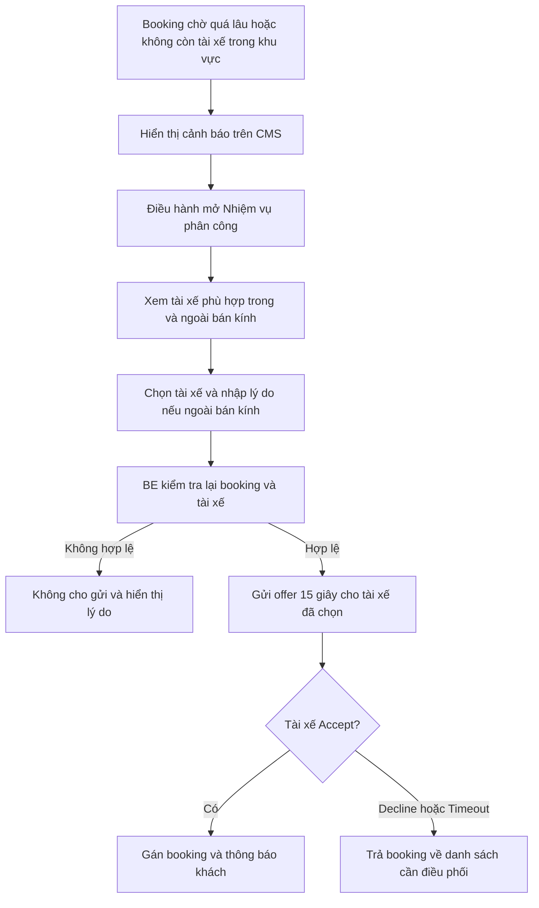
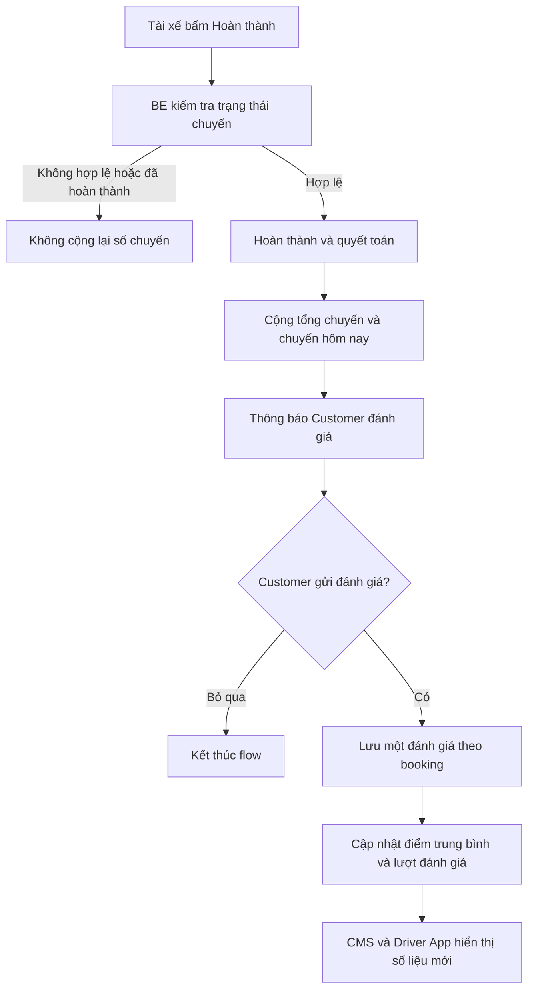
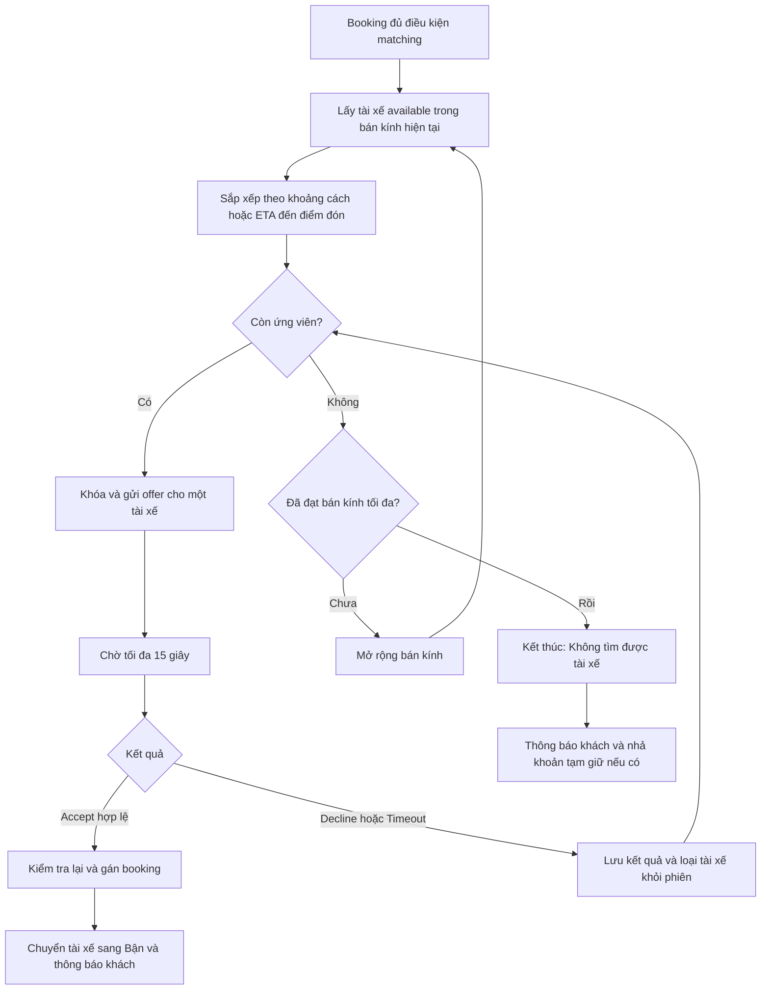
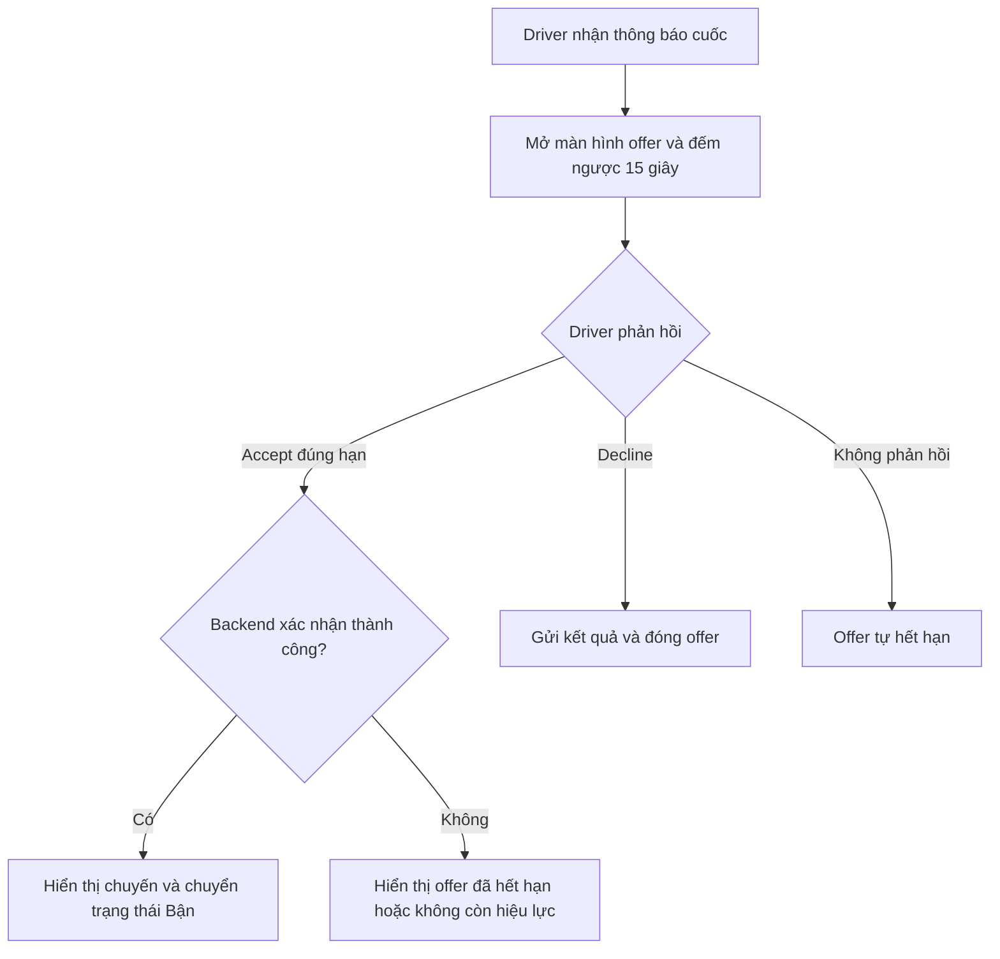
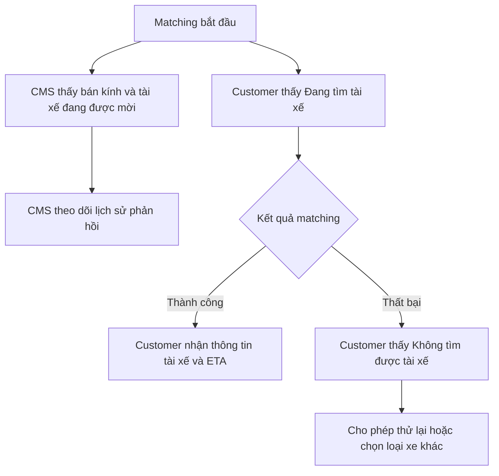

# Epic 4 — Ghép chuyến tuần tự cho tài xế

## 1. Trả lời chốt

Khi booking đã đủ điều kiện thanh toán, backend lấy danh sách tài xế available từ Epic 2 và gửi offer **lần lượt từng tài xế**.

Mỗi tài xế có **15 giây** để Accept hoặc Decline. Nếu Decline hoặc hết thời gian, hệ thống gửi cho tài xế tiếp theo. Khi có người Accept thành công, booking được gán và quá trình tìm kiếm dừng ngay.

“Round-robin” trong phạm vi này được hiểu là **gửi tuần tự một người tại một thời điểm**, không phải chia đều cuốc theo vòng cố định. Thứ tự ứng viên được tính từ khoảng cách hoặc ETA đến **điểm đón của khách**, không tính từ vị trí tài xế vừa từ chối.

## 2. Phạm vi tính năng

### Trong phạm vi

- Tạo danh sách ứng viên từ các tài xế available.
- Sắp xếp ứng viên theo khoảng cách/ETA đến điểm đón.
- Gửi offer cho từng tài xế với thời hạn 15 giây.
- Xử lý Accept, Decline, Timeout và offer hết hạn.
- Ngăn booking hoặc tài xế bị gán trùng.
- Mở rộng bán kính theo cấu hình Epic 2 khi hết ứng viên.
- Thông báo kết quả cho Customer, Driver và CMS.
- Lưu lịch sử từng lần gửi offer.

### Chưa ưu tiên trong Epic 4

- Flow refund đầy đủ sau khi đã capture tiền.
- Cấu hình zone tính giá hoặc arrival zone.
- Thuật toán cân bằng cuốc nâng cao theo doanh thu hoặc số chuyến.

Lưu ý: dù refund đầy đủ chưa ưu tiên, khoản tiền chỉ đang tạm giữ vẫn phải được nhả khi booking kết thúc vì không tìm được tài xế.

## 3. Quy tắc ghép chuyến

1. Chỉ booking đủ điều kiện ở Epic 2 mới được bắt đầu matching.
2. Danh sách ứng viên phải được kiểm tra available tại thời điểm sử dụng.
3. Một booking chỉ có một offer còn hiệu lực tại một thời điểm.
4. Một tài xế chỉ có một offer còn hiệu lực tại một thời điểm.
5. Thời hạn 15 giây được tính và kết thúc bởi backend.
6. Accept sau thời hạn phải trả kết quả offer đã hết hạn, không được gán chuyến.
7. Tài xế Decline hoặc Timeout không được mời lại trong cùng phiên matching của booking.
8. Trước khi gán, backend kiểm tra lại booking và tài xế để tránh nhận trùng.
9. Accept thành công: tài xế chuyển Bận, booking chuyển đã có tài xế và các offer khác bị vô hiệu.
10. Hết ứng viên: mở rộng bán kính theo cấu hình loại xe rồi tạo danh sách mới.
11. Đạt bán kính tối đa mà vẫn không có người nhận: kết thúc matching và thông báo không tìm được tài xế.

## 4. Trạng thái kết quả offer

| Kết quả | Hành động tiếp theo |
|---|---|
| **Accept hợp lệ** | Gán booking, chuyển tài xế sang Bận và dừng tìm |
| **Decline** | Lưu lý do nếu có, loại khỏi phiên hiện tại và chọn người tiếp theo |
| **Timeout** | Đánh dấu hết hạn, loại khỏi phiên hiện tại và chọn người tiếp theo |
| **Accept trễ** | Báo offer đã hết hạn, không gán booking |
| **Tài xế không còn available** | Bỏ qua và chọn người tiếp theo |
| **Booking đã được nhận/hủy** | Dừng offer và không cho thao tác tiếp |

## 5. Điều phối thủ công từ CMS

CMS cho phép điều hành can thiệp khi:

- Booking chờ quá ngưỡng thời gian do BA cấu hình; hoặc
- Hệ thống không còn tài xế available trong bán kính tìm kiếm hiện tại; hoặc
- Phiên matching tự động kết thúc nhưng điều hành vẫn muốn tìm tài xế ở phạm vi rộng hơn.

Màn **Nhiệm vụ phân công → Bike & Car** cần hiển thị:

- Thời gian booking đã chờ.
- Loại xe khách đặt, điểm đón, điểm đến và hình thức thanh toán.
- Bán kính/vòng matching hiện tại và lý do cần điều hành can thiệp.
- Tài xế phù hợp trong bán kính: khoảng cách/ETA, trạng thái, tổng chuyến, chuyến hôm nay và đánh giá.
- Tài xế phù hợp ngoài bán kính: hiển thị riêng và cảnh báo khoảng cách.
- Lý do tài xế không thể chọn, ví dụ Offline, Bận, sai loại xe được phép nhận, GPS cũ hoặc hồ sơ hết hạn.

Quy tắc điều phối thủ công:

1. Chỉ người có quyền điều phối mới được thao tác.
2. Chỉ chọn tài xế Online, đúng loại xe được phép nhận, không có chuyến/offer khác và hồ sơ hợp lệ.
3. Điều hành có thể chọn tài xế phù hợp ngoài bán kính hiện tại khi booking đã đủ điều kiện can thiệp; phải nhập lý do.
4. Không được chọn tài xế Offline hoặc Bận.
5. Bấm **Gửi cuốc cho tài xế** chỉ tạo offer cho người được chọn; tài xế vẫn có 15 giây Accept/Decline.
6. Không gán cưỡng bức tài xế khi chưa có xác nhận nhận chuyến.
7. Decline/Timeout thì booking quay lại danh sách cần điều phối và CMS hiển thị kết quả.
8. Mọi lần chọn tài xế, lý do can thiệp và kết quả phải có nhật ký.

### User flow — Điều phối thủ công

## 6. Hoàn thành chuyến, thống kê và đánh giá tài xế

### Cập nhật số chuyến

Khi tài xế bấm **Hoàn thành** và backend xác nhận thành công:

- Booking và nhiệm vụ chuyển sang Hoàn thành.
- Tài xế được cộng **một chuyến hoàn thành**.
- Tổng chuyến hoàn thành tăng 1.
- Chuyến hôm nay tăng 1 theo ngày của `completedAt` tại múi giờ Việt Nam.
- Tài xế được giải phóng khỏi trạng thái Bận sau khi quyết toán thành công.

Không cộng chuyến trong các trường hợp Accept, Bắt đầu chuyến, Hủy, No-show hoặc thao tác Hoàn thành bị gửi lặp lại.

### Khách đánh giá tài xế

Sau khi chuyến hoàn thành:

1. App Customer hiển thị yêu cầu đánh giá tài xế.
2. Khách chọn từ 1 đến 5 sao, có thể thêm nhận xét hoặc thẻ đánh giá.
3. Mỗi booking chỉ được gửi một đánh giá và chỉ khách của booking đó được đánh giá.
4. Khách có thể bỏ qua; booking vẫn được xem là hoàn thành.
5. Sau khi gửi, hệ thống cập nhật điểm trung bình và tổng lượt đánh giá của tài xế.
6. CMS hiển thị điểm trung bình, số lượt đánh giá và danh sách đánh giá theo booking.
7. App Driver hiển thị điểm trung bình, tổng lượt và phản hồi gần nhất; không hiển thị thông tin liên hệ riêng tư của khách.

MVP không cho admin sửa điểm sao và không cho gửi đánh giá lần hai. Trường hợp ẩn nhận xét vi phạm cần một quyền kiểm duyệt nội dung riêng, không làm thay đổi điểm sao gốc.

### User flow — Hoàn thành và đánh giá

## 7. Phạm vi ảnh hưởng theo vai trò

| Vai trò | Phần phải thực hiện | Kết quả mong đợi |
|---|---|---|
| **CMS** | Theo dõi matching; lịch sử offer; cảnh báo chờ lâu; điều phối thủ công; xem số chuyến và đánh giá tài xế | Điều hành biết hệ thống đang tìm đến đâu và can thiệp có kiểm soát |
| **BE** | Lập danh sách, khóa offer, timeout 15 giây, chống gán trùng, mở rộng bán kính, hoàn thành chuyến, cộng số chuyến và tổng hợp đánh giá | Matching và dữ liệu hiệu suất tài xế vận hành nhất quán |
| **FE Customer** | Hiển thị đang tìm tài xế, kết quả matching và form đánh giá sau chuyến | Khách theo dõi được kết quả và gửi phản hồi cho đúng tài xế |
| **FE Driver** | Nhận offer, đếm ngược, Accept/Decline, hoàn thành chuyến; xem tổng chuyến, chuyến hôm nay và đánh giá | Tài xế thao tác đúng vòng đời chuyến và theo dõi hiệu suất cá nhân |
| **BA** | Chốt thứ tự ưu tiên, ngưỡng chờ lâu, quyền điều phối, quy tắc tính chuyến, nội dung đánh giá và kịch bản tranh chấp | Mọi trường hợp tự động và thủ công có kết quả nghiệp vụ xác định |

## 8. User flow — Hệ thống ghép chuyến

## 9. User flow — Tài xế nhận offer

## 10. User flow — Khách và CMS

## 11. Checklist triển khai theo vai trò

### CMS

- Hiển thị đúng offer đang hoạt động và thời gian còn lại.
- Có lịch sử từng tài xế, thời điểm gửi và kết quả.
- Không cho admin Accept thay tài xế trong flow tự động.
- Cảnh báo booking chờ quá lâu và cho phép điều phối thủ công theo quyền.
- Hiển thị khoảng cách/ETA, lý do không available, tổng chuyến, chuyến hôm nay và đánh giá khi chọn tài xế.

### BE

- Timeout do backend quản lý, không tin thời gian đếm ngược từ app.
- Có khóa chống hai tài xế cùng Accept hoặc một tài xế nhận hai booking.
- Kiểm tra lại available trước khi gửi và trước khi gán.
- Không mời lại tài xế đã Decline/Timeout trong cùng phiên.
- Cộng số chuyến đúng một lần khi hoàn thành và tổng hợp đánh giá theo booking.

### FE

- Driver vẫn phải nhận kết quả chính thức từ backend sau khi bấm Accept.
- Driver hiển thị rõ offer hết hạn, không còn hiệu lực hoặc nhận thành công.
- Customer chỉ thấy trạng thái tìm kiếm tổng thể, không thấy từng tài xế từ chối.
- Customer có hướng xử lý khi không tìm được tài xế.
- Customer được đánh giá sau khi hoàn thành; Driver xem được số chuyến và phản hồi của mình.

### BA

- Chốt tiêu chí sắp xếp chính và tiêu chí phụ khi hai tài xế tương đương.
- UAT Accept ở giây cuối, Accept trễ, hai Accept đồng thời, Driver mất mạng và Customer hủy khi đang matching.
- Chốt xử lý khoản tạm giữ và nội dung thông báo khi matching thất bại.
- Chốt ngưỡng chờ lâu, quyền điều phối ngoài bán kính và bộ thẻ đánh giá.

## 12. Tiêu chí nghiệm thu

- Mỗi offer có đúng 15 giây phản hồi do backend quản lý.
- Decline hoặc Timeout tự chuyển sang ứng viên tiếp theo.
- Một booking chỉ được gán một tài xế và một tài xế chỉ được gán một booking tại cùng thời điểm.
- Tài xế Accept trễ không nhận được chuyến.
- Hết ứng viên phải mở rộng bán kính đúng cấu hình.
- Không tìm được tài xế thì kết thúc flow rõ ràng và xử lý khoản tạm giữ.
- CMS điều phối thủ công được khi chuyến chờ lâu hoặc không có tài xế trong khu vực; Driver vẫn phải Accept.
- Hoàn thành chuyến chỉ cộng tổng chuyến và chuyến hôm nay đúng một lần.
- Customer chỉ đánh giá một lần cho chuyến đã hoàn thành; điểm trung bình và lượt đánh giá cập nhật đúng.
